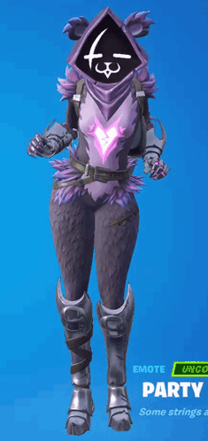

# Purrnite
#### ⚠️ it works, but it's a work in progress! ⚠️

  
<small><i>(look at her go she's adorable)</i></small>
 

Silly project that regularly scans trough Fortnite's shop for cute furry skins.  
Mostly made this to get the Raven Team Leader skin in the future, as I missed most of the OG event.

### Scans for
- Raven Team Leader
- Highwire / Pack Leader Highwire
- Meowskulls

If you wish to request a skin, [open up an issue!](https://github.com/FlooferLand/purrnite/issues/new)
If you want to manually add your own skins _(furry or not)_ scroll down.

### Why?
While.. some people are down bad..  
I'm mostly making this project as I don't really feel represented playing a human in this game
as almost all of the human girl skins in this game look uncanny as hell to me.  

I feel more normal playing as Peely than any of the normal human skins xD

There are also websites to let you see the shop daily,
but you have to search through it yourself day by day, for potentially up to a whole year.  

### How?
This project uses several APIs as fallbacks in case one of them go down, is slow, or inaccurate.  
- [FortniteAPI.io](https://fortniteapi.io/)
- [Fortnite-API.com](https://fortnite-api.com/)
- [Fortnite fandom news tab](https://antifandom.com/fortnite/wiki/Nevermore_Hearts_Pack) _(TO DO!)_

This project will not generally slow down your PC,
but on slower systems every 5 hours or so you may experience a lag spike.  

### How do I install this?
1. Go to the releases panel on GitHub
2. Download the latest version
3. Create a shortcut to the executable inside `%AppData%\Microsoft\Windows\Start Menu\Programs\Startup` so it runs all the time Windows runs.
4. Get an API key/token at [FortniteAPI.io](https://dashboard.fortniteapi.io) _(don't worry it's free)_
5. Search "Edit the system environment variables" in your start menu, click "Environment Variables"
6. Click on `New` and add `IO_KEY` as the variable name, with your key as the variable value.
7. Done! You may now launch the program. It will automatically start when Windows starts from now on

### Is this a virus? 🤓☝️
**Nuh uh.**
While there are malicious things on GitHub, you are free to look through the source code yourself!

Everything in the releases section is built using GitHub Actions,
so there is no way I could insert something malicious without it showing up in the source code.

### How do I add/remove a skin?
You may [open up an issue!](https://github.com/FlooferLand/purrnite/issues/new) if you want more skins added!

If you want to do it yourself:
- Download the project _(I recommend cloning it with [git](https://git-scm.com))_
- Install [Rust](https://rust-lang.com/)
- Navigate to [src/fortnite/skins.rs](./src/fortnite/skins.rs)
    1. Add a new `SkinDef` object inside `SKINS`
       _(you can usually find all the data relevant to your skin on Fortnite's Fandom page)_
    2. Add a new entry in `SkinTag`
- Run `cargo build --release` in the root of the project
- Done!

### How do I stop the program?
- Open task manager, search "purr", and end it.

This project does not have a tray icon unlike some of my other projects, as I gave up trying to fiddle around with Tokio to make it work.
